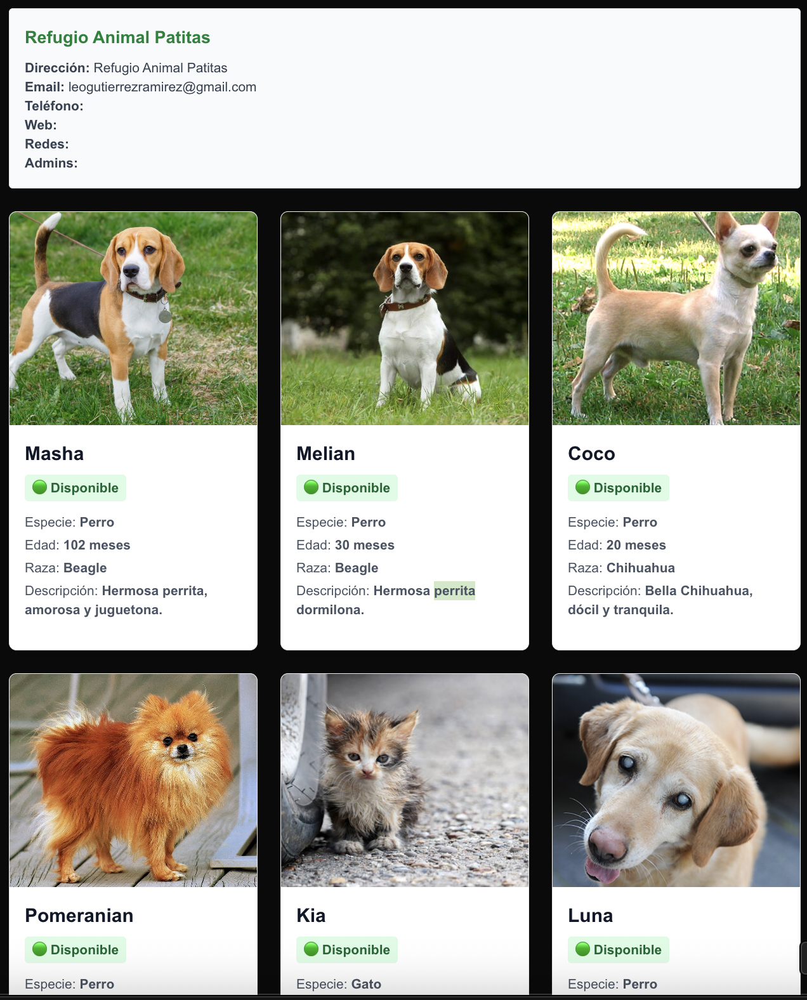
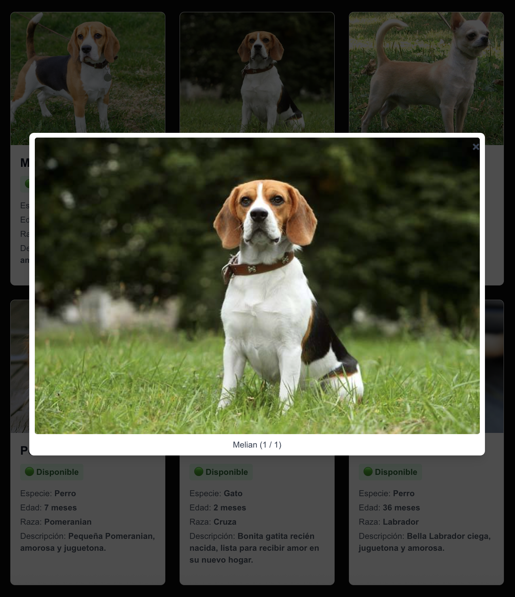
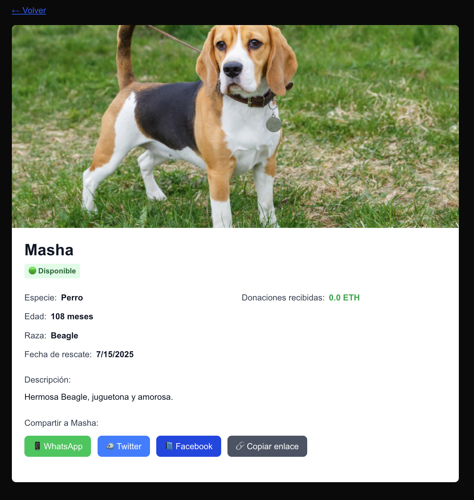
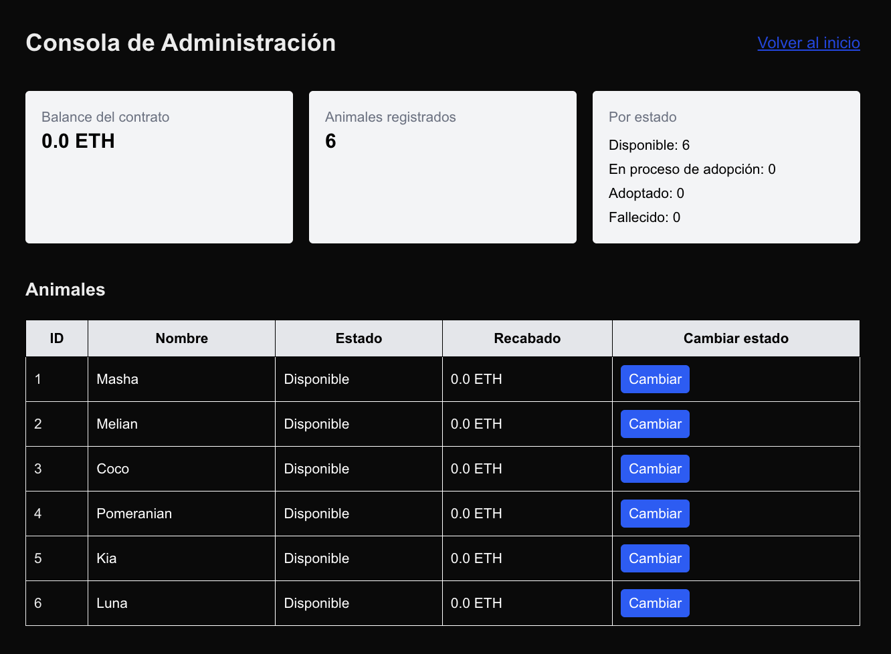

# Refugio Animal DApp

[](https://github.com/leogtzr/refugio-animales-dapp/actions/workflows/test.yml)

[🇬🇧 Read this in English](./README.md)

Una aplicación descentralizada (DApp) para refugios de animales, construida con **Solidity** (Smart Contract) y **Next.js** (Frontend). Este proyecto permite a los refugios registrar animales rescatados, recibir donaciones y gestionar solicitudes de adopción de forma transparente en la blockchain.

---

## Funcionalidades

- **Registrar animales rescatados** con imágenes (almacenadas en IPFS).
- **Donar** al refugio o a animales específicos (ETH).
- **Solicitar adopción** de animales disponibles.
- **Panel de administración** para gestionar solicitudes y estados de adopción.
- **Panel de usuario** para ver tus donaciones.
- **Toda la información y acciones quedan registradas en la blockchain**.

---

## Tecnologías

- **Smart Contract:** Solidity (Foundry, OpenZeppelin)
- **Frontend:** Next.js, React, TailwindCSS
- **Blockchain:** Nodo local Anvil (o testnet Sepolia)
- **IPFS:** Pinata (vía API) para imágenes

---

## UI

Probablemente va a cambiar un poco:










---

## Inicio Rápido

### 1. Clona el repositorio

```bash
git clone https://github.com/youruser/refugio-animal.git
cd refugio-animal
```

### 2. Instala dependencias
```bash
npm install
```

### 3. Despliega el Smart Contract (Local)
Inicia un nodo local con Anvil:
```bash
anvil
```
Si obtienes errores relacionado con el tamaño del Smart Contract, utiliza los siguientes parámetros:
```bash
anvil --code-size-limit 999999
```

Despliega el contrato usando Foundry:
```bash
forge script script/Deploy.s.sol --rpc-url http://127.0.0.1:8545 --broadcast --private-key <TU_PRIVATE_KEY>
```

La dirección del contrato está en `src/utils/constants.ts` como `CONTRACT_ADDRESS`. Actualízala si es necesario.

### 4. Configura variables de entorno
Crea un archivo .env.local en la raíz con tus credenciales de Pinata y Web3.Storage:
```bash
PINATA_API_KEY=tu_pinata_api_key
PINATA_API_SECRET=tu_pinata_api_secret
NEXT_PUBLIC_WEB3STORAGE_TOKEN=tu_web3storage_token
```

### 5. Ejecuta la DApp
```bash
npm run dev
```
Abre http://localhost:3000 en tu navegador.

## Uso

### Registrar Animales (Admin)
- Solo el owner o los admins pueden registrar nuevos animales.
- Completa el formulario, sube hasta 3 imágenes (se almacenan en IPFS) y envía.


## Donaciones
- Cualquier usuario puede donar ETH al refugio o a un animal específico.
- Las donaciones quedan registradas en la blockchain y son visibles en la interfaz.

## Solicitudes de Adopción
- Los usuarios pueden solicitar la adopción de animales disponibles llenando un formulario.
- Los admins revisan y aprueban/rechazan solicitudes desde el panel de administración.

## Panel de Administración
- Accesible solo para owner/admins.
- Gestiona solicitudes de adopción, aprueba adopciones, actualiza estado/info de animales y la información del refugio.

## Descripción del Smart Contract
- Gestión de Animales: Registrar, actualizar y rastrear animales y su estado.
- Donaciones: Recibir y rastrear donaciones por animal y para el refugio.
- Adopciones: Gestionar solicitudes, aprobaciones y cambios de estado.
- Info del Refugio: Almacenar y actualizar datos de contacto y admins.
- Sistema de Admins: El owner puede agregar/quitar admins.
Ver `src/RefugioAnimal.sol` para detalles completos.


## Estructura del Proyecto
```
.
├── src/
│   ├── app/                # App Next.js
│   ├── components/         # Componentes React (AnimalList, AdoptionModal, etc.)
│   ├── hooks/              # Hooks personalizados (useWallet, useContract, useAnimals)
│   ├── pages/api/          # API (subida a Pinata)
│   ├── utils/              # Utilidades de contrato e IPFS
│   └── RefugioAnimal.sol   # Smart contract Solidity
├── script/                 # Scripts de despliegue Foundry
├── test/                   # Tests del contrato
├── public/                 # Archivos estáticos
├── package.json
├── foundry.toml
└── ...
```

## Despliegue

- **Local**: Usa Anvil y Foundry como se describe arriba.
- **Testnet**: Actualiza `CONTRACT_ADDRESS` y despliega en Sepolia u otra testnet.
- **Producción**: Despliega el frontend en Vercel, Netlify o tu hosting favorito.

## Requisitos

- Node.js >= 18
- Foundry (para Solidity)
- Anvil (blockchain local)
- Metamask (para conectar wallet)


## Licencia
MIT

## Créditos
- [OpenZeppelin Contracts](https://github.com/OpenZeppelin/openzeppelin-contracts)
- [Foundry](https://github.com/foundry-rs/foundry)
- [Pinata](https://www.pinata.cloud/)
- [Web3.Storage](https://web3.storage/)

## Contacto
Para dudas o contribuciones, abre un issue o contacta a [Leonardo Gutiérrez R.](mailto:leogutierrezramirez@gmail.com).