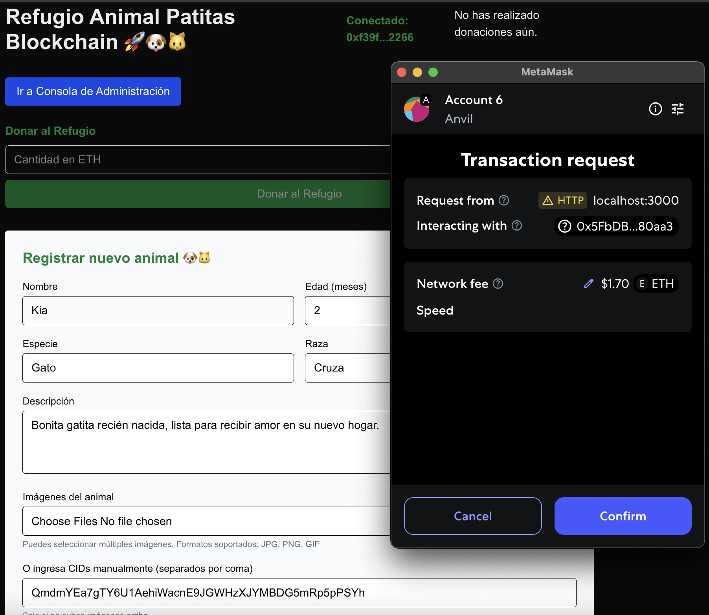

# Refugio Animal DApp

[🇪🇸 Read this in Spanish](./README.es.md)

A decentralized application (DApp) for animal shelters, built with **Solidity** (Smart Contract) and **Next.js** (Frontend). This project allows animal shelters to register rescued animals, receive donations, and manage adoption requests transparently on the blockchain.

---

## Features

- **Register rescued animals** with images (stored on IPFS).
- **Donate** to the shelter or to specific animals (ETH).
- **Request adoption** for available animals.
- **Admin panel** for managing adoption requests and animal status.
- **User dashboard** to view your donations.
- **All data and actions are stored on-chain** for transparency.

---

## Tech Stack

- **Smart Contract:** Solidity (Foundry, OpenZeppelin)
- **Frontend:** Next.js, React, TailwindCSS
- **Blockchain:** Local Anvil node (or Sepolia testnet)
- **IPFS:** Pinata (via API) for animal images

---

## UI

It will probably change in the near future.
refugio-animal-registering-animal.png


---

## Quick Start

### 1. Clone the repository

```bash
git clone https://github.com/youruser/refugio-animal.git
cd refugio-animal
```

### 2. Install Dependencies
```bash
npm install
```

### 3. Deploy the Smart Contract (Local)
Start a local Anvil node:
```bash
anvil
```
If you get errors due to the size of the Smart Contract, use the following parameters instead:
```bash
anvil --code-size-limit 999999
```

Deploy the contract using _Foundry_:
```bash
forge script script/Deploy.s.sol --rpc-url http://127.0.0.1:8545 --broadcast --private-key <YOUR_PRIVATE_KEY>
```
The default contract address is set in `src/utils/constants.ts` as `CONTRACT_ADDRESS`. Update it if needed.

### 4. Configure Environment Variables
Create a .env.local file in the root with your Pinata and Web3.Storage credentials:
```bash
PINATA_API_KEY=your_pinata_api_key
PINATA_API_SECRET=your_pinata_api_secret
NEXT_PUBLIC_WEB3STORAGE_TOKEN=your_web3storage_token
```

### 5. Run the DApp
```bash
npm run dev
```
Open http://localhost:3000 in your browser.

## Usage
### Registering Animals (Admin)
- Only the contract owner or admins can register new animals.
- Fill out the registration form, upload up to 3 images (stored on IPFS), and submit.

### Donating
- Anyone can donate ETH to the shelter or to a specific animal.
- Donations are tracked on-chain and visible in the UI.

### Adoption Requests
- Users can request to adopt available animals by filling out a form.
- Admins review and approve/reject requests in the admin panel.

### Admin Panel
- Accessible to contract owner/admins.
- Manage adoption requests, approve adoptions, update animal status/info, and update shelter info.

## Smart Contract Overview
- **Animal Management**: Register, update, and track animals and their status.
- **Donations**: Accept and track donations per animal and for the shelter.
- **Adoptions**: Handle adoption requests, approvals, and status changes.
- **Shelter Info**: Store and update shelter contact and admin info.
- **Admin System**: Owner can add/remove admins.

See `src/RefugioAnimal.sol` for full contract details.

## Project Structure
```
.
├── src/
│   ├── app/                # Next.js app directory
│   ├── components/         # React components (AnimalList, AdoptionModal, etc.)
│   ├── hooks/              # Custom React hooks (useWallet, useContract, useAnimals)
│   ├── pages/api/          # API routes (upload to Pinata)
│   ├── utils/              # Contract and IPFS utilities
│   └── RefugioAnimal.sol   # Solidity smart contract
├── script/                 # Foundry deployment scripts
├── test/                   # Smart contract tests
├── public/                 # Static assets
├── package.json
├── foundry.toml
└── ...
```

## Deployment
- Local: Use Anvil and Foundry as described above.
- Testnet: Update `CONTRACT_ADDRESS` and deploy to Sepolia or another testnet.
- Production: Deploy the frontend to Vercel, Netlify, or your preferred host.

## How to build the Smart Contract / MetaMask / Anvil
[How to](./docs/HOWTODEPLOY.md)

## Requirement
- Node.js >= 18
- Foundry (for Solidity development)
- Anvil (for local blockchain)
- Metamask (for wallet connection)

## License
MIT

## Credits
- [OpenZeppelin Contracts](https://github.com/OpenZeppelin/openzeppelin-contracts)
- [Foundry](https://github.com/foundry-rs/foundry)
- [Pinata](https://www.pinata.cloud/)
- [Web3.Storage](https://web3.storage/)

## Contact
For questions or contributions, open an issue or contact [Leonardo Gutiérrez R.](mailto:leogutierrezramirez@gmail.com).