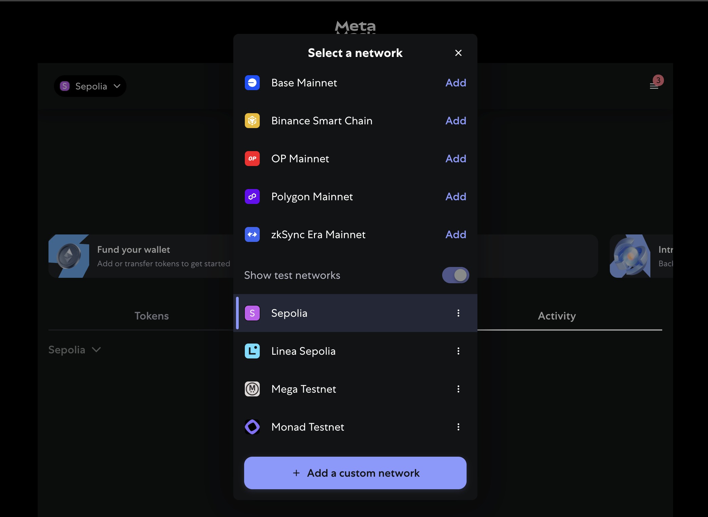
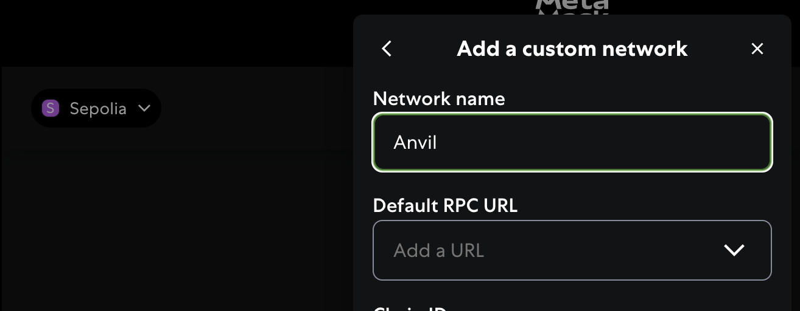
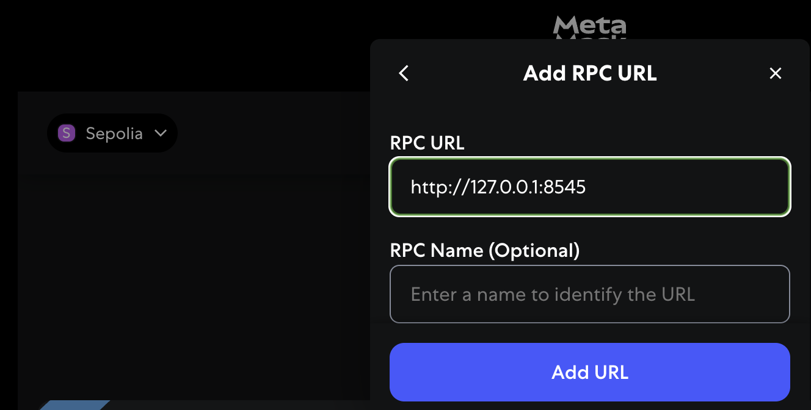
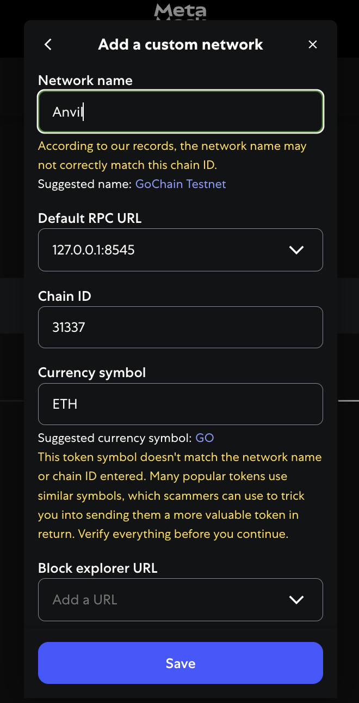
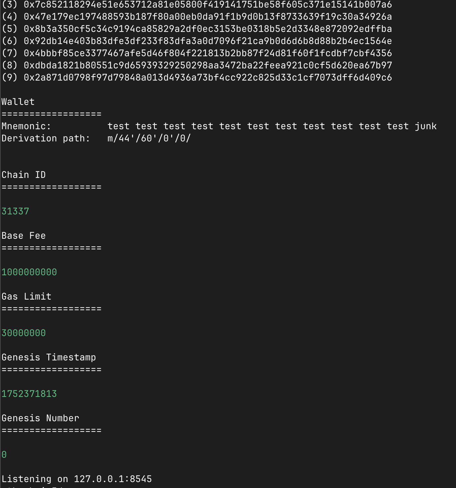
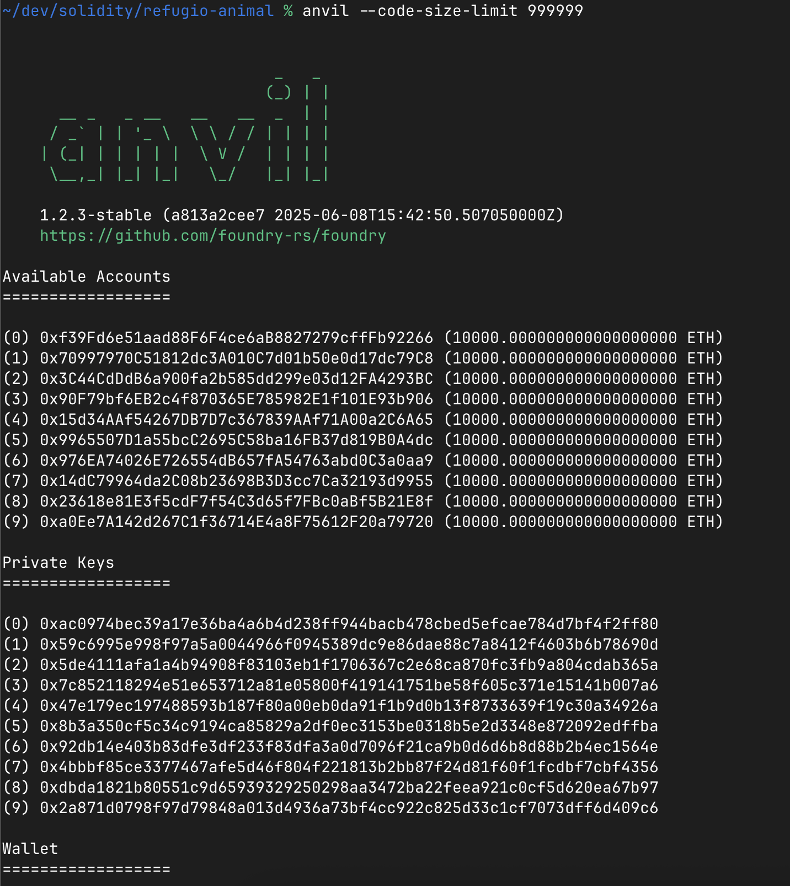

# How to deploy step by step

## Add the Anvil Network to MetaMask
### 1. Open the MetaMask extension

### 2. Click on the list of networks
You will get something like this, then click on "+ Add a custom network"

### 3. Type the Network name
Add a Network name and then click on "Add a URL"/"Add RPC URL"

Add the RPC URL (you can get the RPC URL in the `anvil`'s command output')

### 4. Fill the Anvil network details

### 5. Anvil command output

