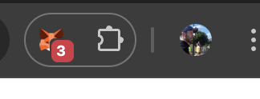

# How to deploy step by step

## Add the Anvil Network to MetaMask
### 1. Open the MetaMask extension


### 2. Click on the list of networks
You will get something like this, then click on "+ Add a custom network"


### 3. Type the Network name
Add a Network name and then click on "Add a URL"/"Add RPC URL"


Add the RPC URL (you can get the RPC URL in the `anvil`'s command output')


### 4. Fill the Anvil network details


### 5. Anvil command output


## Build the Smart Contract
### 1. Build build
```bash
$ forge build src/RefugioAnimal.sol
[⠊] Compiling...
[⠒] Compiling 5 files with Solc 0.8.30
[⠆] Solc 0.8.30 finished in 100.93ms
Compiler run successful!
```

A directory named `out/` will be created with the output of the building (ABI):
```
out/RefugioAnimal.sol/RefugioAnimal.json
```

### 2. Run the tests
```bash
forge test
```

### 2. Deploy the Smart Contract using the Deploy script
```bash
forge script script/Deploy.s.sol --rpc-url http://127.0.0.1:8545 --broadcast --private-key 0xac0974bec39a17e36ba4a6b4d238ff944bacb478cbed5efcae784d7bf4f2ff80                                                                                                             
```

The private address is simply one of the mentioned in the `anvil` command output.


```bash
forge script script/Deploy.s.sol --rpc-url http://127.0.0.1:8545 --broadcast --private-key 0xac0974bec39a17e36ba4a6b4d238ff944bacb478cbed5efcae784d7bf4f2ff80                                                                                                                                                                     [⠊] Compiling...
[⠒] Compiling 16 files with Solc 0.8.30
[⠑] Solc 0.8.30 finished in 496.67ms
Compiler run successful!
Script ran successfully.
Error: `RefugioAnimal` is above the contract size limit (25240 > 24576).
Do you wish to continue? yes

## Setting up 1 EVM.

==========================

Chain 31337

Estimated gas price: 2.000000001 gwei

Estimated total gas used for script: 7350408

Estimated amount required: 0.014700816007350408 ETH

==========================

##### anvil-hardhat
✅  [Success] Hash: 0x0618168f521f71516912b62ca3343bf282cd02ac74c5ee2ddbb0de8cfc180023
Contract Address: 0x5FbDB2315678afecb367f032d93F642f64180aa3
Block: 1
Paid: 0.00565416000565416 ETH (5654160 gas * 1.000000001 gwei)

✅ Sequence #1 on anvil-hardhat | Total Paid: 0.00565416000565416 ETH (5654160 gas * avg 1.000000001 gwei)


==========================

ONCHAIN EXECUTION COMPLETE & SUCCESSFUL.

Transactions saved to: /Users/leogtzr/dev/solidity/refugio-animal/broadcast/Deploy.s.sol/31337/run-latest.json

Sensitive values saved to: /Users/leogtzr/dev/solidity/refugio-animal/cache/Deploy.s.sol/31337/run-latest.json
```

In the `anvil` output text you will see something like this:
```bash

    Transaction: 0x0618168f521f71516912b62ca3343bf282cd02ac74c5ee2ddbb0de8cfc180023
    Contract created: 0x5FbDB2315678afecb367f032d93F642f64180aa3
    Gas used: 5654160

    Block Number: 1
    Block Hash: 0x39f3095a6854cdfa8d3028bcbfe9515fd6703fe26fe4cdfff37307a4f02b34e2
    Block Time: "Sun, 13 Jul 2025 20:38:25 +0000"
    
```